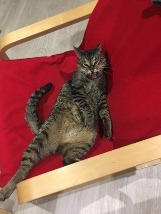
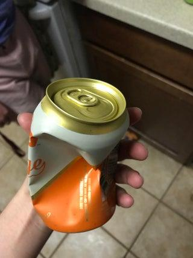
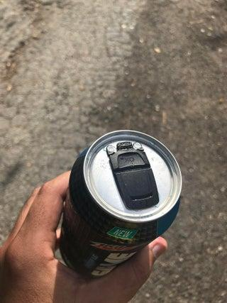
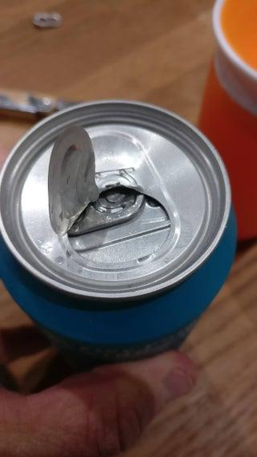
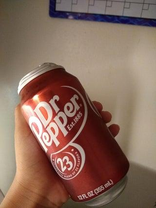
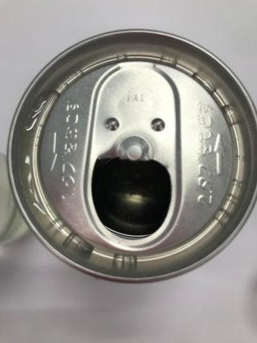
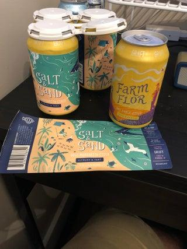

# Birds of a Feather: Enhancing Multimodal Fake News Detection via Multi-Element Retrieval

This repository provides the implementation of the paper **"Birds of a Feather: Enhancing Multimodal Fake News Detection via Multi-Element Retrieval"**.
## Requirements
To run the code, ensure that you have the following dependencies installed:
- Python 3.8 or higher
- PyTorch 2.0.0 or higher
- dhg
## Project Structure
```
ReTIP/
│
├── data_process/              # Scripts for data preprocessing
│   ├── add_author.py          # Adds author information to the dataset
│   ├── add_caption.py         # Adds captions to dataset entries
│   ├── add_retrieval.py       # Adds retrieval-key to the dataset
│   ├── datapkl_gen.py         # Generates dataset pickle files and retrieval related news
│   ├── user_embd_gen.py       # Generates user embeddings
│   └── user_trieval.py        # Retrieval related users
│
├── HGNNP.py                   # Hypergraph model
├── argument.py                # Parses and handles command-line arguments
├── dataset.py                 # Loads  datasets
├── retip.py                   # Main model
├── test.py                    # Script for model testing and evaluation
├── train.py                   # Script for training the model
└── utils.py                   # Utility functions
```
## Experiment Settings
```
|                      | K(Retrieved_items_num) | M(Retrieved_users_num) |
| -------------------- | ---------------------- | ---------------------- |
| Fakeddit             | 9                      | 3                      |
| ReCOVery             | 9                      | 12                     |
| MM-COVID19           | 2                      | 2                      |
| Common Configuration | 9                      | 12                     |
```
## Case Study
Here are some randomly selected target news items and their corresponding retrieval instances, where the first column is the targeted news item.

<div style="display: flex; flex-wrap: nowrap; align-items: center; width: 760px; overflow-x: auto;">

  

  

  

  

  

  

</div>
<div style="display: flex; flex-wrap: nowrap; align-items: center; width: 760px; overflow-x: auto;">

  

  

  

  

  

  

</div>

<div style="display: flex; flex-wrap: nowrap; align-items: center; width: 760px; overflow-x: auto;">

  

  

  

  

  

  

</div>

<div style="display: flex; flex-wrap: nowrap; align-items: center; width: 760px; overflow-x: auto;">

  

  

  

  

  

  

</div>

<div style="display: flex; flex-wrap: nowrap; align-items: center; width: 760px; overflow-x: auto;">

  

  

  

  

  

  

</div>


## Dataset
- Fakeddit https://github.com/entitize/fakeddit
- ReCOVery https://github.com/apurvamulay/ReCOVery
- MM-COVID19 https://github.com/bigheiniu/MM-COVID
## Data Preprocessing and Retrieval
- Download the pretrained models from the following links:
https://huggingface.co/Salesforce/blip-image-captioning-large
https://huggingface.co/openai/clip-vit-base-patch32
- Run the following command to preprocess the data:
```bash
python datapkl_gen.py #TEXT_EMD_FLAG=True VISUAL_EMD_FLAG=True LOAD_FLAG=False RETRIEVAL_FLAG=False
python add_caption.py
python add_retrieval.py
python user_embd_gen.py
python add_author.py
python user_retrieval.py
python datapkl_gen.py #TEXT_EMD_FLAG=False VISUAL_EMD_FLAG=False LOAD_FLAG=True RETRIEVAL_FLAG=True
```
## Training
- Run the following command to train the model:
```bash
python train.py
```
## Evaluation
- Run the following command to evaluate the model:
```bash
python test.py
```


​    
